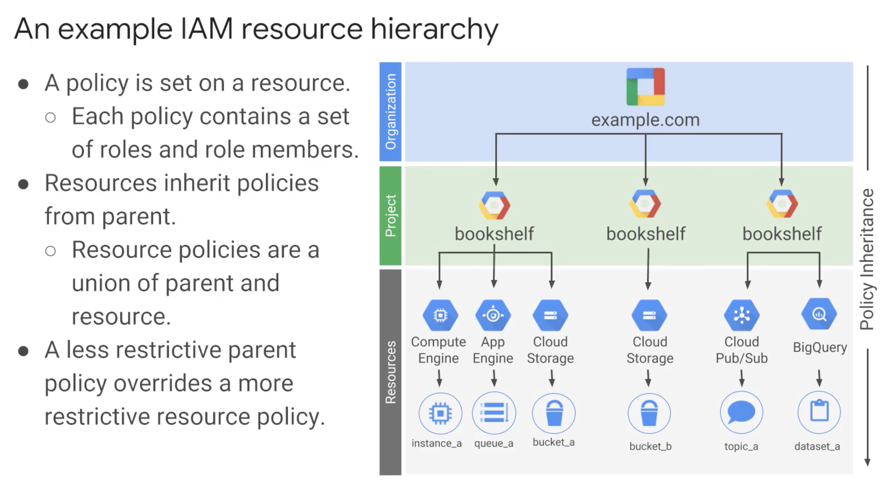
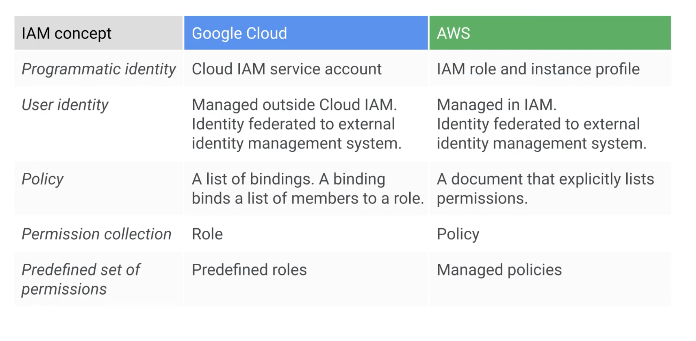

# Basics comparisons between AWS and GCP

## Google Cloud Resource Hierarchy

In order of hierarchy:

- __Organization Node:__ Top of the hierarchy.
- __Folders__: Groups projects or other folders.
- __Projects:__ Groups every resource (instances, storage, etc).

This lets you put policies over any of these and some resources let you put policies on individual resources too.

All resources belong to a project. Each project is a separate comparment and each resource belongs to exactly one.

Project Id IS GLOBALLY UNIQUE AND INMUTABLE.
Project Name does not need to be UNIQUE AND MUTABLE.
Project number IS GLOBALLY UNIQUE AND INMUTABLE. ASSIGNED BY GCP.

Projects CAN be organized into folders, but don't have to.

You can `use folders to assign IAM policies` (e.g. for a team working on projects inside this folder) intead of putting duplicate copies of same policies to projects inside this folder. __ANALOGY__ such as with `user groups` in AWS.

__NOTE:__ To use folders you need an `organization node` at the top of the hierarchy.

Organization nodes are the top of the hierarchy and has some special policies associated:
- Organization policy administrator: Broad control over all cloud resources.
- Project creator role: Fine grained control over project creation.

If you have a g-suite domain, GCP project will automatically belong to the organization node, otherwise, you can use `Google cloud identity` to create one.

Resources inherits policies from parent projects and parent organization node. Policy inheritance is __TRANSITIVE__.

## Billing

Each project can have its own billing account or one billing account can be used for the entire organization, which differs of AWS, who just can roll up billing by sub accounts.

## IAM (Identity and Access Management)

Google cloud identity and Access Management Management can define:

- WHO: Defined by a g-suite user, serice account, google group, g-suite domain. (-> AWS Principal or Users or User groups).
- CAN DO WHAT: defined by IAM role (groups permissions). 3 types of roles: Primitive, Predifined, Custom. (-> IAM roles and Actions and WS managed policies and Inlice policies respectively).
- ON WHICH RESOURCE:  (-> Resources)

__Primitive roles__ are broad, affecting all resources on a project. Being `owner`, `editor`, `viewer` and `billing administrator`. A project can have multiple owners, editors, viewers and billing administrators. `owners` can also set up billing among modification (e.g. deliting). editors can change the state of a resource and viewers can only see the resource.

Compute Engine instance admin role lets whoever has that role perform a certain type of actions to that machine. 

__Custom Roles__: are the fine grained roles in GCP. Couple cautions of custom roles: You need to manage the permissions and set up and can only be used at project or organization levels.

__Service accounts__: use to give permissions to services using criptograpic keys to access resources.

## Ways of interacting with GCP

- Cloud Platform Console: Web Interface for administration. Gives access to cloud shell (cli interace in the browser).
- Cloud Shell or Cloud SDK: gcloud, gsutil (Cloud storage), bq (Big Query). Available via `cloud shell`. SDK can be installed on own computers. Also available as `docker image`.
- Cloud Console Mobile App: 
- REST-based API: Programmatic access to services. Most APIs include daily quotas and limits that can be raised by request. Many API are off by default. `Google Cloud Client Libraries` are the latest and recommended way and `Google API Client Libraries` open source and supported by various languages. If some service doesn't have a Google client library you can use google api client libraries.

