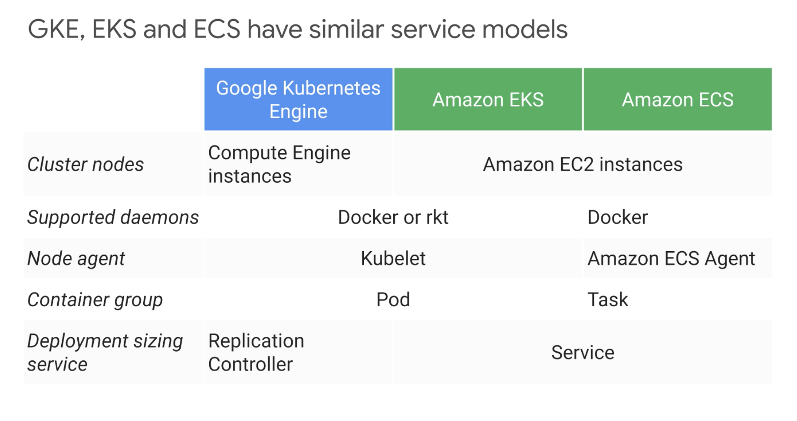
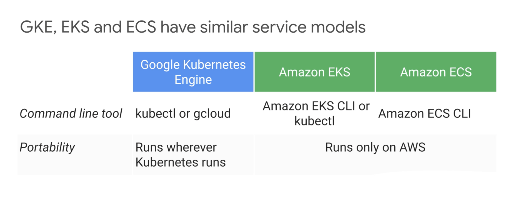

# Containers in GCP

- Google Container Registry

## Kubernetes Engine

- __Kubernetes__: 

Open source orchestrator for containers.
- Application config
- Managing updates: Roll up and Roll back updates
- Monitoring
- Scaling
- Resiliency

Deploy containers on a set of nodes called `cluster`.
- Master Node: controls the system as whole
- Nodes: Computing instance
- How applications interact with each other?

Kubernetes has an API that lets people to control his operation:
- kubectl

__How to get a Kubernetes cluster?__

Can use Kubernetes Engine (kubernetes as a managed service in the cloud)

```bash
gcloud container clusters create k1
```

GKE clusters can be customized and support:
- Machine Types
- Number of Nodes
- Network Settings

Whenever Kubernetes deploys a container or a set of related containers it do so inside a `pod`. A `pod` is the smallest deployable unit on kubernetes. Think as one process in the cluster (could be 1 component of your application or even the entire application). 
- It's common to have 1 container per `pod`, but, if you have multiple containers with a hard dependency, they can be packaged into a single `pod`, automatically share networking and have disk storage volumes in common. 
- Each `pod` gets a unique IP address in the cluster and set of ports for the containers.
- 

kubectl starts a `deployment`. A `deployment` represents a group of replicas of the same `pod`, keeps pods running even if a node where some of them fails. 

By default `pods` in the `deployment` are only accessible inside your cluster. To make `pods` in your `deployment` publicly available you can connect a `load balancer` to it. Kubernetes then create a `service` with a fixed IP address for the `pods`. A `service` is gthe fundamental way kubernetes represents load balancing. You request kubernetes to attach an external load balancer with a public IP address to the `service`. 

Kubernetes has a declarative way of definying full infrastructure, deployment strategy, autoscaling (using more replicas), way of grouping pods using labels to create a service and add an external load balancer.


How do we run a container in a pod?

```
kubectl run my-nginx --image=nginx:1.15.7
kubectl get pods
```

How to we make our pod public accessible? This a assigns a fixed IP address:

```
kubectl expose deployments my-nginx --port=80 --type=LoadBalancer
kubectl get services
```

How do we scale our deployment? Let's configure 3 nginx we servers:

```
kubectl scale my-nginx --replicas=3
```

How about autoscaling? Min and max number of `pods` and a criteria for scaling up:

```
kubectl autoscale my-nginx --min=10 --max=15 --cpu=80
```

True power of Kubernetes comes when you use declarative way to deploy your cluster, using a configuration YAML file:

```
kubectl get pods -l "app=my-nginx" -o yaml
```

Go to [simple_deployment.yaml](simple_deployment.yaml) to see an example of a kubernetes configuration file.

- `selector` field so the deployment knows how to group specific pods as replicas. It works, because every pod has a label tag.

To view your replicas:

```
kubectl get replicasets
kubectl get pods
kubectl get deployments
kubectl get services
```

What happens if you want to update your application?

- use the update `strategy` and specify what strategy to use for deployment.


## AWS vs GCP



