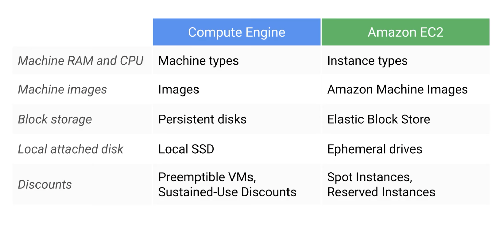

# Virtual Machines

With Google Compute Engine and Google Virtual Networking.

## Virtual Private Cloud (VPC)

- Each VPC network is contained in a GCP project. You can connect resources to each other, and isolate them from one another. 
- Use firewall rules to restrict access to instances.
- VPC have global scope and can have subnets in any region worldwide
- Can have resources in different zones in the same subnet.

## Compute Engine

- Linux, Windows boot images or bring your own.
- Charge by second.
- Pick memory and CPU from predefined ones or make a custom vm
- Pick and attach GPU if you need them.
- Two kinds of Persistent storage: Standard or SSD. For local SSDK this does not last once the vm terminates.
- Define a start up script if you like (for bootstraping).
- Take snapshots of the disk to keep as backup or migrate vm to somewhere else.
- Huge VM or Autoscaling for resilient scalable applications.
- Load balancing for distributing traffic.

__Differences between EC2 and Compute Engine__

- Faster spin-ups (seconds)
- Preemptible VMS nearly up to 80% savings (AWS Spot Instances)
- Discount Pricing

